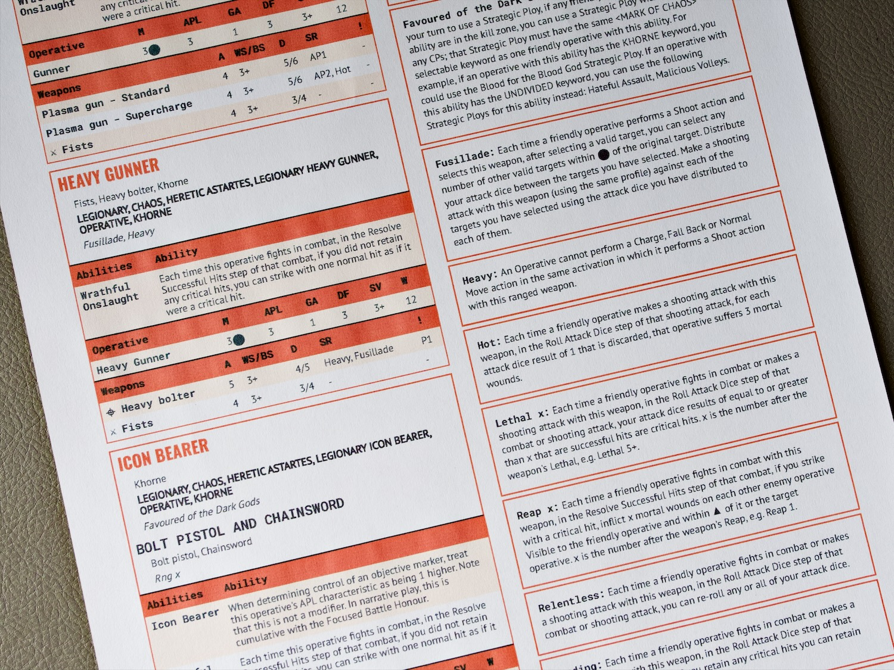

# Warhammer CSS for Battlescribe

This CSS adds Warhammer flavour to Battlescribe's HTML output for your Warhammer 40,000 and Kill Team rosters. It’s designed to be more practical for referencing during games and features a print-friendly mode.

In a browser, Kill Team sheets look like this:

In a browser, 40,000 sheets look like this:

When printed, sheets are set into two columns, which works well for most Kill Team rosters but not so well for 40K because units feature more information. 

Printed Kill Team sheets look like this:

## How to use

1. Grab the replacement CSS for the roster type you want:
    - [Kill Team](killteam-battlescribe.css)
    - [40,000](40k-battlescribe.css)
2. Use Battlescribe to generate an HTML file and open in a text editor
3. Copy the full text of the CSS
4. Paste it into the HTML file, replacing everything between and **including** the `` tags
5. Save the HTML and open it in a web browser
6. To print, please use Chrome or Firefox (Safari won't print with the print viewm for some reason). Ensure that the Background Graphics option is checked in the print dialog

## Notes

- I'm neither a designer nor a web developer, so I'm making no claims for my CSS skills.
- **Kill Team CSS** is redesigned for the current 2021 edition, but it's relatively untested. I welcome feedback for fixes and improvements.
- **40K CSS** was designed for 9th Edition. It's untested for 10th Edition.
- The CSS displays your roster in two ways. On your screen it should appear as a single column and be fairly clear to reference on a tablet during a game. Print it out and it switches to a two-column view with smaller text.
- There are page break rules to prevent entries from splitting over columns and pages. I optimised it for keeping units and operatives on single pages. The first page may be almost empty, and models with long lists of rules might break over pages and generally look terrible, but I've done what I can to make it practical.

Please feel free to use as-is and, of course, adapt/amend to your heart's content. Share any improvements with the community; I'll do my best to add any changes I feel improve the stylesheet. Hope it's useful!